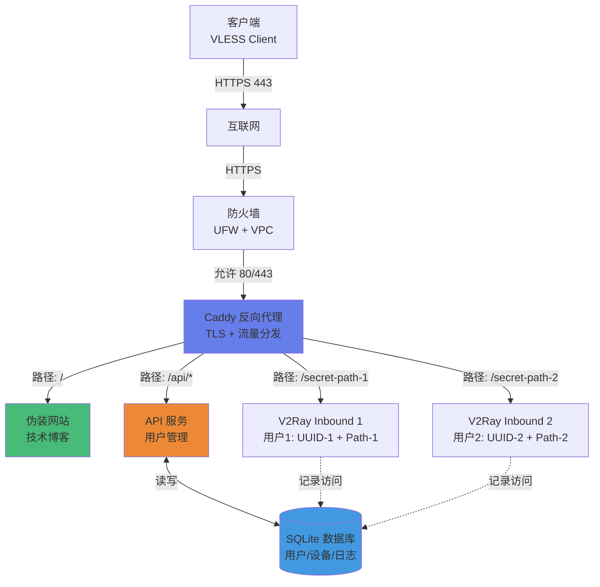

# Avalon Tunnel

**智能化的 V2Ray 代理管理系统，专为 IPv6-only 环境优化**

## 🎯 核心特性

- **流量伪装**：伪装成正常 HTTPS 网站，通过 WebSocket 传输代理流量
- **多用户管理**：每个用户独立 UUID + 独立秘密路径，强绑定防止滥用
- **自动化部署**：一键部署，自动配置防火墙、TLS 证书、服务验证
- **RESTful API**：动态用户管理、配置热更新、设备访问追踪
- **IPv6 优先**：针对 IPv6-only 环境优化，自动 DNS64/NAT64 配置

---

## 🏗️ 架构流程



**流量伪装原理**：
1. 外部看起来是访问 `https://your-domain.com`（正常 HTTPS 网站）
2. 根路径 `/` 显示技术博客（伪装内容）
3. 只有知道秘密路径的客户端才能连接代理（如 `/vaa7JWI4...`）
4. UUID 和路径强绑定，防止凭证分享

---

## 🚀 快速开始

### 前提条件

- **服务器**：Ubuntu 20.04+，支持 IPv6
- **域名**：已解析到服务器 IP
- **端口**：开放 80/443（VPC 安全组 + UFW）

### 一键部署

```bash
# 1. 克隆项目
git clone https://github.com/your-repo/Avalon-Tunnel.git
cd Avalon-Tunnel

# 2. 配置域名
echo "DOMAIN=your-domain.com" > .env

# 3. 完整部署（防火墙 + 配置 + 启动 + 验证 + API）
make deploy
```

**就这么简单！** 🎉

部署完成后：
- ✅ V2Ray 代理服务运行在后台
- ✅ Caddy 自动申请 TLS 证书
- ✅ 默认用户 `Morgan` 已创建
- ✅ API 服务运行在 `https://your-domain.com/api`

---

## 📱 客户端连接

部署成功后，终端会显示连接信息：

```
📧 用户: Morgan@avalon-tunnel.com
🆔 UUID: a1b2c3d4-e5f6-7890-abcd-ef1234567890
🔗 连接: vless://a1b2c3d4-...@your-domain.com:443?type=ws&security=tls&path=%2Fsecret-path...
```

**重要**：IPv6-only 服务器需在客户端开启 **"优先使用 IPv6"**

---

## 🔧 管理命令

### 核心服务
```bash
make start        # 启动核心服务（V2Ray + Caddy）
make stop         # 停止所有服务
make restart      # 重启核心服务
make status       # 查看服务状态
```

### API 管理
```bash
make api-start    # 启动 API 服务器
make api-stop     # 停止 API 服务器
make api-logs     # 查看 API 日志
```

### 配置与诊断
```bash
make config       # 重新生成配置文件
make check-pre    # 环境预检查
make check-post   # 服务验证
make clean        # 清理所有容器
make clean-data   # ⚠️ 清理用户数据（危险）
```

---

## 🌐 API 使用

### 访问 API 文档
```
https://your-domain.com/docs
```

### 创建新用户
```bash
curl -X POST https://your-domain.com/api/users \
  -H "Content-Type: application/json" \
  -d '{"email": "user@example.com"}'
```

### 获取用户列表
```bash
curl https://your-domain.com/api/users
```

### 查看设备访问记录
```bash
curl https://your-domain.com/api/devices
```

---

## 🔐 安全特性

### 多层防护
1. **UUID + 路径强绑定**：每个用户独立 inbound，UUID 和秘密路径一一对应
2. **流量伪装**：外部看起来是正常 HTTPS 网站
3. **设备追踪**：记录 User-Agent、IP、访问路径（为未来设备限制做准备）
4. **TLS 加密**：所有流量通过 Let's Encrypt 证书加密

### 防滥用机制
- ❌ **无法分享凭证**：UUID 和路径绑定，分享无效
- ✅ **设备追踪**：记录每个设备的访问历史
- 🔜 **设备限制**：未来支持限制设备数量

---

## 📊 开发路线图

### ✅ Phase 1（已完成）
- [x] 基础代理功能（V2Ray + Caddy）
- [x] 流量伪装（WebSocket + TLS）
- [x] 自动化部署脚本
- [x] IPv6-only 环境优化
- [x] 多用户多路径架构

### ✅ Phase 2（已完成）
- [x] 数据库驱动的配置管理
- [x] RESTful API（用户管理）
- [x] 设备访问日志记录
- [x] 配置热更新

### 🔜 Phase 3（规划中）
- [ ] 设备数量限制
- [ ] 流量统计与监控
- [ ] Grafana + Prometheus 监控面板
- [ ] Web 管理界面
- [ ] 自动化测试（CI/CD）

---

## 🛠️ 技术栈

| 组件 | 技术 | 用途 |
|------|------|------|
| **代理核心** | V2Ray (VLESS) | 流量代理 |
| **反向代理** | Caddy 2 | TLS + 路由分发 |
| **API 服务** | FastAPI + Uvicorn | 用户管理 |
| **数据库** | SQLite | 配置存储 |
| **容器化** | Docker + Compose | 服务编排 |
| **自动化** | Makefile + Shell | 部署脚本 |

---

## 📝 项目结构

```
Avalon-Tunnel/
├── app/                    # Python 应用
│   ├── api/               # API 路由和模型
│   ├── database/          # 数据库操作
│   ├── services/          # 业务逻辑
│   └── main.py            # 配置生成器
├── docker/                # Docker 配置
│   ├── Dockerfile.api     # API 服务镜像
│   └── Dockerfile.manager # 配置管理镜像
├── scripts/               # 自动化脚本
│   ├── diagnose-pre.sh    # 环境预检查
│   ├── diagnose-post.sh   # 服务验证
│   ├── setup-firewall.sh  # 防火墙配置
│   └── restart-v2ray.sh   # V2Ray 重启
├── data/                  # 持久化数据
│   ├── avalon.db          # SQLite 数据库
│   └── caddy/             # TLS 证书
├── public/                # 伪装网站
├── Makefile               # 自动化命令
├── docker-compose.yml     # 服务编排
└── README.md              # 本文档
```

---

## 🤝 贡献

欢迎提交 Issue 和 Pull Request！

---

## 📄 许可证

MIT License

---

## ⚠️ 免责声明

本项目仅供学习和研究使用。请遵守当地法律法规，合理使用网络资源。
