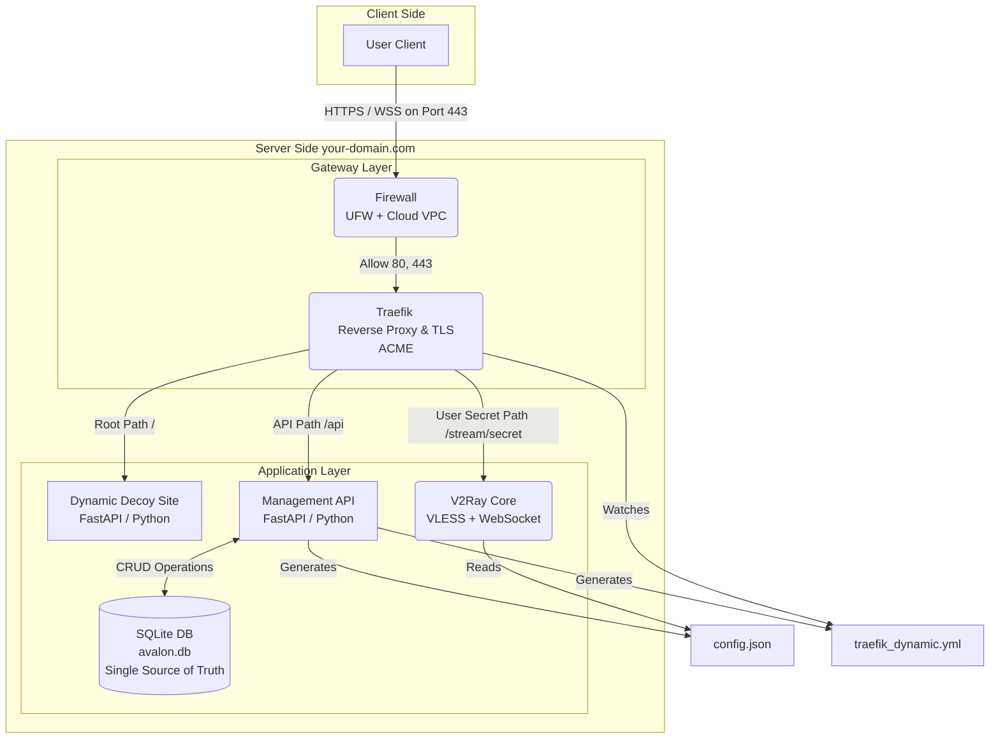

# Avalon Tunnel

**An intelligent, self-hosted proxy management system optimized for IPv6-only environments, featuring a dynamic deception layer for advanced camouflage.**

---

## Core Features

- **Dynamic Deception Layer**: Goes beyond simple static pages. The decoy website is a living, interactive application designed to generate plausible, dynamic traffic patterns to provide camouflage against passive traffic analysis.
- **Robust Security**: Each user is assigned a unique UUID and a unique high-entropy secret path. Credentials are not shared, and traffic is end-to-end encrypted with TLS.
- **Fully Automated Deployment**: A simple docker compose command handles service setup and automatic TLS certificate acquisition via Traefik.
- **Single Database Source of Truth**: All configurations (domain, API key, V2Ray settings, users, paths) are stored inside the SQLite database (avalon.db). Migrating the system is as simple as copying this database file.
- **RESTful API**: A FastAPI-based control plane for dynamic user management, device tracking, and configuration updates.
- **IPv6-First Design**: Optimized for IPv6-only servers, incorporating DNS64/NAT64 awareness and IPv6-centric configurations.

---

## Architecture Overview

Avalon Tunnel employs a multi-layered, service-oriented architecture designed for security and portability. The database `avalon.db` acts as the single source of truth. On startup, the API server reads the database and automatically writes out the necessary V2Ray and Traefik config files.


```mermaid
graph TD
    subgraph Client Side
        Client[User Client]
    end

    subgraph Server Side your-domain.com
        subgraph Gateway Layer
            Firewall(Firewall <br> UFW + Cloud VPC)
            Traefik(Traefik <br> Reverse Proxy & TLS ACME)
        end

        subgraph Application Layer
            Decoy[Dynamic Decoy Site <br> FastAPI / Python]
            API[Management API <br> FastAPI / Python]
            V2Ray(V2Ray Core <br> VLESS + WebSocket)
            Database[(SQLite DB <br> avalon.db <br> Single Source of Truth)]
        end
    end

    Client -- HTTPS / WSS on Port 443 --> Firewall
    Firewall -- Allow 80, 443 --> Traefik

    Traefik -- Root Path / --> Decoy
    Traefik -- API Path /api --> API
    Traefik -- User Secret Path /stream/secret --> V2Ray

    API <-- CRUD Operations --> Database
    API -- Generates --> V2RayConfig[config.json]
    API -- Generates --> TraefikConfig[traefik_dynamic.yml]
    V2Ray -- Reads --> V2RayConfig
    Traefik -- Watches --> TraefikConfig
```

**How it Works**:

1. All traffic enters through a firewall on port 443, handled by the Traefik reverse proxy.
2. Traefik serves the **Dynamic Decoy Site** (API container) on the root path (`/`), making the server appear as a legitimate, interactive web application.
3. Only clients with knowledge of their unique secret path can access the V2Ray service. Traefik forwards this specific traffic to the V2Ray Core based on the generated dynamic routing rules.
4. The SQLite database `avalon.db` stores all users, secrets, and system configurations. On start or update, the API automatically generates `config.json` (for V2Ray) and `traefik_dynamic.yml` (for Traefik). Traefik automatically hot-reloads its dynamic config without restart.

---

## Quick Start

### Prerequisites

- **Server**: Ubuntu 20.04+ with a public IPv6 address.
- **Domain**: An FQDN pointed to your server's IP address.
- **Firewall**: Ports 80 and 443 must be open in your cloud provider's firewall.

### One-Command Deployment

```bash
# 1. Clone the repository
git clone https://github.com/your-repo/Avalon-Tunnel.git
cd Avalon-Tunnel

# 2. Boot the containers
# The database will initialize automatically with default credentials on first startup
docker compose up -d --build
```

---

## Client Configuration

The deployment logs or API will output the connection info for users.

**Example VLESS URI:**

```
vless://a1b2c3d4-...@your-domain.com:443?type=ws&security=tls&path=%2Fstream%2Fyour-secret-path...#MyConnection
```

**Important**: For IPv6-only servers, ensure your client has an option like **"Prefer IPv6"** enabled.

---

## Management

### Core Services

```bash
docker compose up -d      # Start all services (V2Ray, Traefik, API)
docker compose stop       # Stop all services
docker compose logs -f    # View logs
```

---

## Security Model

### Defense Layers

1. **Unique Credentials**: Each user has a dedicated inbound in V2Ray, with a unique UUID and a unique, high-entropy secret path.
2. **Dynamic Deception**: The proxy's traffic signature is masked by a legitimate, dynamic web application that generates plausible user traffic patterns.
3. **Device Fingerprinting**: The system logs User-Agent and source IP for every connection, paving the way for device-limit enforcement.
4. **End-to-End Encryption**: All traffic is encrypted using TLS, managed automatically by Traefik.

### Anti-Abuse Mechanisms

- **No Credential Sharing**: Because the UUID and secret path are uniquely tied, sharing a VLESS URI is insufficient to grant access if the backend logic requires matching.
- **Optional Credential Rotation**: The API-driven architecture allows for optional, low-frequency automated rotation of secret paths as a security hygiene measure.
- **Device Count Limits**: The system supports tracking of unique devices that are associated with user accounts.

---

## Development Roadmap

### Phase 1 & 2 (Complete)

- Core proxy functionality (V2Ray + Traefik).
- Dynamic Deception Layer (FastAPI-driven decoy site).
- Database-driven configuration (SQLite avalon.db as single source of truth).
- RESTful API for user management.
- Zero-Env runtime file generation on boot.
- Device access logging (fingerprinting).

### Phase 3 (Planned)

- **Enforce Device Limits**: Implement logic to block connections exceeding the configured device limit.
- **Traffic & Performance Monitoring**: Integrate a monitoring stack (e.g., Prometheus + Grafana).
- **Web-based Admin UI**: A simple web interface for managing users.
- **CI/CD Integration**: Automated testing and deployment pipelines.

---

## Tech Stack

| Component         | Technology            | Purpose                               |
| ----------------- | --------------------- | ------------------------------------- |
| **Proxy Core**    | V2Ray (VLESS)         | Core proxy engine                     |
| **Reverse Proxy** | Traefik 3             | Automatic TLS (ACME), routing         |
| **Control Plane** | FastAPI + Uvicorn     | RESTful API & Dynamic Decoy Site      |
| **Database**      | SQLite (avalon.db)    | Single source of truth for settings   |
| **Container**     | Docker + Compose      | Service orchestration                 |